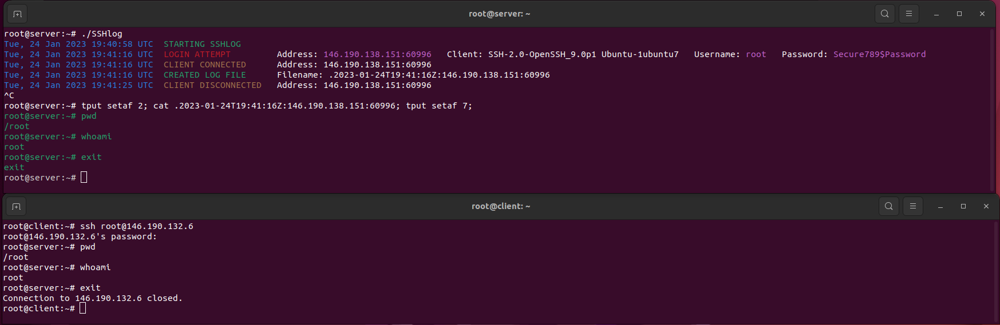

# SSHlog


## Build
```bash
git clone https://github.com/Zilog-Z80/SSHlog.git
cd SSHlog
go build SSHlog.go
./SSHlog
```

## Change SSH Server Port
Standard configuration:  
```bash
nano /etc/ssh/sshd_config
# Uncomment the '#Port 22' line and change to desired port
systemctl restart ssh  
```

Socket activated configuration (ex. Ubuntu 22):
```bash
mkdir -p /etc/systemd/system/ssh.socket.d

cat >/etc/systemd/system/ssh.socket.d/listen.conf <<EOF
[Socket]
ListenStream=
ListenStream=1234
EOF

systemctl daemon-reload
systemctl restart ssh
```

## SSHlog Usage
```bash
./SSHlog # Run with default settings
./SSHlog -h # display usage

Usage of ./SSHlog:
  -k string
    	server private key (default "/etc/ssh/ssh_host_ed25519_key")
  -l	prevent client login
  -m string
    	send message to client on exit
  -p int
    	port (default 22)
  -s	silent mode
  -v	log to stdout (NOT RECOMMENDED)
```

## TODO
- Fix log output spacing
- encrypt log files with password (command line arg)?
- add instructions for switching port on cent os
- add instructions to kill sshd